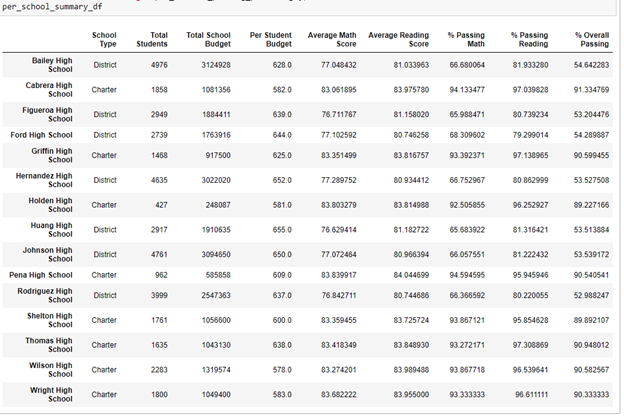

# School_District_Analysis Module 4 Challenge for UofT Bootcamp

## Overview
### Purpose
The client is interested in a summary of key metrics at schools in the district. We are provided with 2 sets of data one for schools and one for students performance. The client suspects an issue with data from one of the grades at a certain school and has asked us to run the analysis with and without this data.

## Results
The results of the analysis is below with a comparison betweeen with and without ninth graders from Thomas High School

### District Summary

Original Summary

Adjusted Summary

#### Effect of adjustment removing ninth graders' grades from Thomas High School

- No change to the total number of students 
- No change to the total budget
- A decrease to average math score after adjustment
- No material change to average reading score
- A decrease to percentage of students passing math
- A decrease to percentage of students passing reading
- A decrease to percentage of students passing both

### School Summary

Original Summary

Adjusted Summary

Only Thomas High School is affected by the adjustment and it decreases averages and passing percentages

### School Rankings
Original Top Schools

Adjusted Top Schools

Thomas High School's rank as the second best school in the district is not affected by the adjustment.

### Math and Reading Scores by Grade

Original Math Scores

Adjusted Math Scores

Original Reading Scores

Adjusted Reading Scores

Only change is 9th graders' from Thomas High School is NaNs.

### Other Metrics

There are no material changes to the following metrics after the adjustments. For images of graph see appendix below.

- Scores by school spending
- Scores by school size
- Scores by school type

## Summary

As shown in the above results, the effect of removing the grades of ninth graders of Thomas High School from the data decreases certain metrics. Average math scores, percentage of students passing math, percentage of students passing reading, and percentage of students passing both are all decreased which means that including the suspect data made the school district look better. The result does not change Thomas High School rank compared to other schools in the district. The lower district metrics as a result of removing the suspect data maybe a better representation of the district's performance.

## Appendix

Original Scores by school spending

Adjusted Scores by school spending

Original Scores by school size

Adjusted Scores by school size

Original Scores by school type

Adjusted Scores by school type

